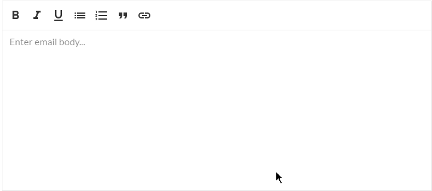

# React - Rich editors

## Synopsis



React rich-editors-like components. Based on [draft-js](https://facebook.github.io/draft-js/).

Package provide these public components:

* **RichEditor**
* **EmailRichEditor**

## Demo and documentation

https://opuscapitabes.github.io/js-react-rich-editors

> Demo powered by [opuscapita-react-showroom](https://github.com/OpusCapitaBES/js-react-showroom-client)

## Usage

```js
import RichEditor from 'opuscapita-react-rich-editors/lib/RichEditor';
...
<RichEditor />
```

## API Reference

Run **demo** or wait for a global [Showroom](https://github.com/OpusCapitaBES/js-react-showroom) demo installation with most of react components and their documentation.

## Grails integration check

```
npm install
npm run grails-plugin-package
```

Then see [src/client/demo/grails-integration.html](./src/client/demo/grails-integration.html)

## Contributors

|  | [**Alexey Sergeev**](https://github.com/asergeev-sc)     |
| :---: | :---: |
|  | [**Kirill Volkovich**](https://github.com/kvolkovich-sc) |

Contributing are welcome. We need YOU! :metal:

## License

OpusCapita 2016
